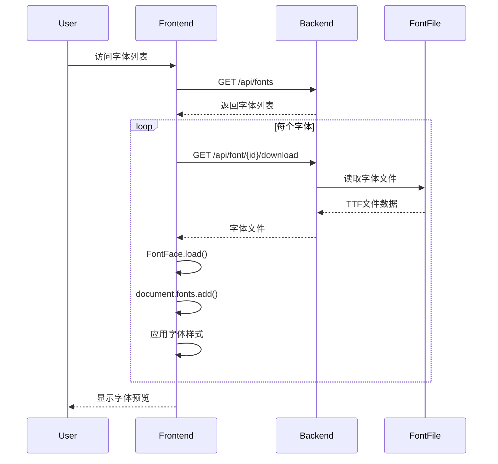

# 字体预览使用指南

## 📋 目录
1. [如何预览字体](#如何预览字体)
2. [预览功能说明](#预览功能说明)
3. [Network Error 解决方法](#network-error-解决方法)
4. [常见问题](#常见问题)

---

## 如何预览字体

### 方法1：在字体列表页预览（快速浏览）

访问 **http://localhost:5174** （My Fonts 页面）

**功能**：
- ✅ 自动加载并显示每个字体的预览文本
- ✅ 每个字体卡片会用实际生成的字体渲染文本
- ✅ 可以快速对比多个字体的视觉效果

**预览文本**：
- "Sphinx of black quartz, judge my vow."
- "Grumpy wizards make toxic brew."
- "The quick brown fox jumps over the lazy dog."

**操作**：
- **Preview 按钮**：点击进入详细预览页面
- **Download 按钮**：直接下载字体文件
- **View Spec**：查看字体规格参数

### 方法2：详细预览页面（完整测试）

点击字体卡片的 **"Preview"** 按钮，或访问：
```
http://localhost:5174/fonts/{fontId}/preview
```

**功能**：
- ✅ **Live Preview**：输入自定义文本实时预览
- ✅ **字体参数调整**：
  - Font Size (字号): 24-72px
  - Font Weight (字重): 100-900
  - Letter Spacing (字间距): -5 to 5
  - Line Height (行高): 1.0-2.0
- ✅ **完整字符集展示**：
  - Uppercase (大写字母 A-Z)
  - Lowercase (小写字母 a-z)
  - Numerals & Punctuation (数字和标点)

**最佳用途**：
- 测试字体在不同字号下的表现
- 验证字间距和行高设置
- 检查所有字符的设计一致性

### 方法3：字体规格页面（查看参数）

点击字体卡片的 **"..."** → **"View Spec"**，或访问：
```
http://localhost:5174/fonts/{fontId}/spec
```

**显示内容**：
- **Basic Information**: 字体名称、版本、格式、样式
- **Design Parameters**: 度量、间距、比例参数
- **Style Definition**: 设计特征、视觉样式
- **Character Set**: 支持的字符集

---

## 预览功能说明

### 字体列表页的预览原理

```typescript
// FontCard.tsx 中的实现
useEffect(() => {
  const loadFont = async () => {
    // 1. 获取字体文件URL
    const downloadUrl = `/api/font/${font.font_id}/download`
    
    // 2. 使用FontFace API加载字体
    const fontFace = new FontFace(fontFamily, `url(${downloadUrl})`)
    await fontFace.load()
    
    // 3. 添加到文档字体集合
    document.fonts.add(fontFace)
    
    // 4. 应用到预览文本
    setFontLoaded(true)
  }
  
  if (font.status === 'completed') {
    loadFont()
  }
}, [font.font_id])
```

### 预览文本的选择

每个字体使用固定的预览文本（基于fontId），确保：
- ✅ 刷新页面后预览文本保持一致
- ✅ 包含常见字母组合
- ✅ 可以快速识别字体特征

---

## Network Error 解决方法

### 错误信息
```
Network Error
```

### 可能的原因和解决方法

#### 1. DeepSeek API 调用失败

**原因**：生成字体时需要调用 DeepSeek AI API，如果API密钥无效或网络问题会失败。

**解决方法**：
1. 检查 API 密钥配置：
   ```bash
   cat config/config.json
   ```
   
2. 确保 `deepseek.apiKey` 字段有效：
   ```json
   {
     "deepseek": {
       "apiKey": "sk-your-actual-api-key-here",
       "apiUrl": "https://api.deepseek.com/v1/chat/completions"
     }
   }
   ```

3. 或设置环境变量：
   ```bash
   export DEEPSEEK_API_KEY="sk-your-actual-api-key-here"
   ```

4. 重启服务：
   ```bash
   ./stop.sh && ./start.sh
   ```

**验证**：
```bash
# 查看后端日志
tail -f logs/backend.log

# 应该看到类似输出：
# "✅ AI分析完成"
# "✅ 字体生成完成"
```

#### 2. 后端服务未启动

**检查**：
```bash
curl http://localhost:3001/health
```

**期望输出**：
```json
{"status":"ok","timestamp":"2025-11-01T..."}
```

**解决方法**：
```bash
./start.sh
```

#### 3. CORS 跨域问题

**症状**：浏览器控制台显示 CORS 错误

**解决方法**：
1. 检查后端 CORS 配置（已自动配置为 `http://localhost:5174`）
2. 确保前端访问地址是 `http://localhost:5174`（不是5173）

#### 4. 前端配置问题

**检查 API 地址**：
前端应该连接到 `http://localhost:3001/api`

```typescript
// frontend/src/pages/FontList.tsx
const API_BASE_URL = import.meta.env.VITE_API_URL || 'http://localhost:3001/api'
```

---

## 常见问题

### Q1: 字体列表页显示的是系统字体，不是生成的字体？

**原因**：字体文件加载失败或还未加载完成。

**解决方法**：
1. 等待几秒，字体加载需要时间
2. 刷新页面
3. 检查浏览器控制台是否有错误信息
4. 确认字体状态是 "completed"（不是 "generating"）

### Q2: 如何对比两个字体的差异？

**方法**：
1. 在字体列表页，多个字体会同时显示，可以直接对比
2. 打开两个浏览器窗口，分别预览不同字体
3. 下载字体文件，在 Font Book 中对比

### Q3: 预览页面可以保存自定义设置吗？

**当前**：不支持保存设置，刷新后会恢复默认值。

**建议**：
- 记录满意的参数设置
- 使用浏览器截图保存预览效果

### Q4: 为什么有些字母显示不正常？

**可能原因**：
1. 字体文件损坏
2. 部分字符未实现（小写字母和标点符号正在完善中）
3. 浏览器字体渲染问题

**解决方法**：
1. 重新生成字体
2. 尝试不同的浏览器
3. 下载字体文件用 Font Book 验证

### Q5: 如何下载字体文件？

**方法1**：点击字体卡片的 **"Download"** 按钮

**方法2**：直接访问 URL
```
http://localhost:3001/api/font/{fontId}/download
```

**方法3**：通过命令行
```bash
curl -O http://localhost:3001/api/font/{fontId}/download
```

---

## 预览最佳实践

### 1. 对比测试流程

**步骤**：
1. 生成多个极端对比的字体：
   - 细腻几何: "生成一个细腻精致的几何风格字体，纤细优雅"
   - 粗壮书法: "生成一个粗壮厚重的书法风格字体，醒目有力"

2. 在字体列表页快速浏览所有字体

3. 选择感兴趣的字体，点击 "Preview" 详细测试

4. 调整参数（字号、字重、间距）观察效果

5. 下载满意的字体文件

### 2. 参数调整建议

**Font Size**：
- 24px: 适合小字阅读测试
- 36px: 适合标题测试
- 48px: 适合海报标题
- 72px: 适合大型展示

**Letter Spacing**：
- -2 to -1: 紧凑排版
- 0: 默认间距
- 1 to 3: 宽松排版

**Line Height**：
- 1.0-1.2: 紧密行距
- 1.5: 标准行距
- 1.8-2.0: 宽松行距

### 3. 测试文本建议

**包含所有字母**：
```
The quick brown fox jumps over the lazy dog
ABCDEFGHIJKLMNOPQRSTUVWXYZ
abcdefghijklmnopqrstuvwxyz
0123456789
```

**测试特殊组合**：
```
fi fl ff ffi ffl  // 连字测试
AVAW TOY          // 字距测试
i l 1 | I         // 易混淆字符
```

**实际内容测试**：
```
使用真实标题、段落文本测试字体的实际效果
```

---

## 技术细节

### 字体加载流程



### API 端点

| 端点 | 方法 | 功能 |
|------|------|------|
| `/api/fonts` | GET | 获取字体列表 |
| `/api/fonts/:fontId` | GET | 获取字体详情 |
| `/api/fonts/:fontId` | DELETE | 删除字体 |
| `/api/font/:fontId/download` | GET | 下载字体文件 |
| `/api/font/:fontId/preview` | GET | 获取预览信息 |
| `/api/analyze-requirements` | POST | AI分析需求 |
| `/api/generate-font` | POST | 生成字体 |

---

## 更新日志

### 2025-11-01
- ✅ 修复 FontCard 组件，添加实际字体文件加载
- ✅ 添加字体加载状态显示
- ✅ 优化预览性能
- ✅ 完善错误处理

---

**相关文档**：
- `API_CONFIG.md` - API配置说明
- `DUPLICATE_FUNCTION_FIX.md` - 字体显示问题修复
- `AI_PROMPT_OPTIMIZATION_V2.md` - AI参数优化说明

