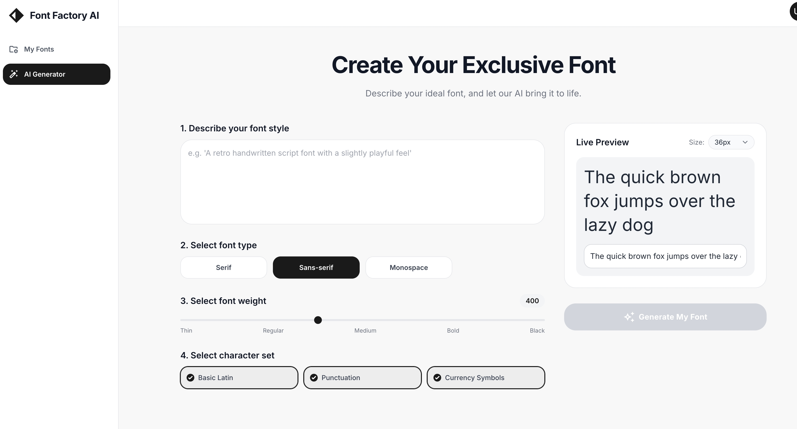
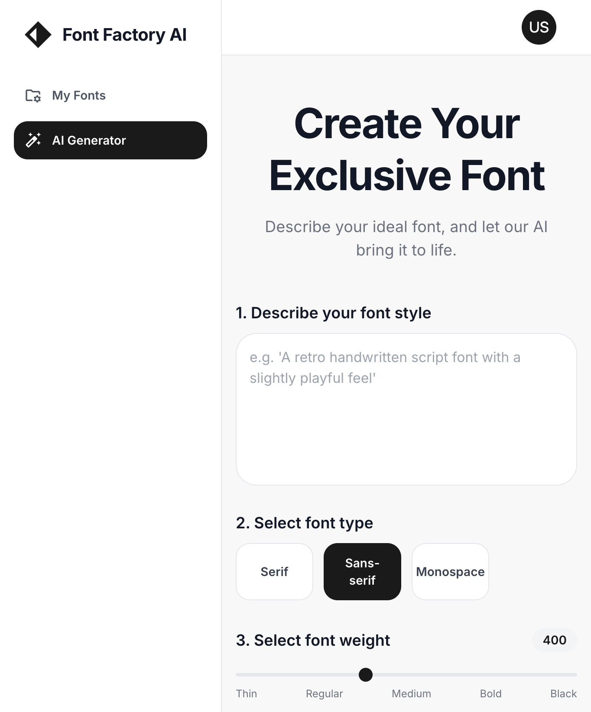

# QuickFont (EZfont) - AI 智能字体生成器

<div align="center">


**用 AI 在几分钟内创建专业字体**  
**Create professional fonts in minutes with AI**

[](https://opensource.org/licenses/MIT)
[](https://nodejs.org/)
[](https://www.python.org/)
[](https://www.typescriptlang.org/)

[English](#english) | [中文](#中文)

</div>

---

## 中文

### 🎨 项目简介

QuickFont（又名 EZfont）是一个基于 AI 的智能字体生成工具，让用户能够在几分钟内创建专业级的原创字体。只需描述你想要的字体风格，我们的 AI 将分析你的需求并生成自定义的 TrueType 字体文件。



### ✨ 核心特性

- 🤖 **AI 智能设计**：使用 DeepSeek AI 分析用户需求，生成详细的字体设计规范
- 🎯 **参数化生成**：基于设计参数（笔画宽度、对比度、笔画末端、拐角等）创建字体
- 📐 **专业品质**：生成兼容 macOS、Windows 和 Linux 的标准 TrueType (.ttf) 字体
- 🎨 **实时预览**：支持自定义文本、大小、粗细和间距的实时预览
- 📚 **字体管理**：查看、预览、下载和管理所有生成的字体
- 🔧 **简单易用**：简洁的 Web 界面，无需设计经验

### 🚀 快速开始

#### 环境要求

- **Node.js** >= 16.0.0
- **Python** >= 3.8
- **npm** 或 **yarn**
- **DeepSeek API 密钥**（在 [DeepSeek](https://platform.deepseek.com/) 获取）

#### 安装步骤

1. **克隆仓库**
   ```bash
   git clone https://github.com/Coldplay-now/EZfont.git
   cd EZfont
   ```

2. **配置 API 密钥**
   ```bash
   cp config/config.json.example config/config.json
   # 编辑 config/config.json，添加你的 DeepSeek API 密钥
   ```

3. **安装依赖**
   ```bash
   # 安装前端依赖
   cd frontend && npm install && cd ..
   
   # 安装后端依赖
   cd backend && npm install && cd ..
   
   # 安装 Python 依赖
   cd font-generator && pip install -r requirements.txt && cd ..
   ```

4. **启动服务**
   ```bash
   # 同时启动前端和后端
   ./start.sh
   ```

5. **访问应用**
   - 前端界面：http://localhost:5174
   - 后端 API：http://localhost:3001
   - 健康检查：http://localhost:3001/health

### 📖 使用方法

#### 创建字体

1. 进入 **AI 生成器** 页面
2. 输入字体描述（例如："生成一款现代几何字体，简洁且极简主义"）
3. 选择字体类型、粗细和字符集
4. 点击 **生成我的字体**
5. 等待 AI 分析和字体生成
6. 预览并下载你的字体！



#### 示例描述

**快速示例**：
- "生成一款极细的几何字体，优雅轻盈，笔画粗细均匀，现代极简风格"
- "生成一款超粗黑体字，厚重醒目，横细竖粗，冲击力强"
- "生成一款时尚斜角字体，笔画末端锐利，尖角设计，动感前卫"
- "生成一款复古圆润字体，笔画末端圆滑，拐角柔和，温暖怀旧"
- "生成一款开放式字体，字母开口大，通透明亮，现代简约"

更多字体设计理论和实践指导，请查看项目文档：
- **[英文字体创作AI Agent PRD](英文字体创作AI_Agent_PRD.md)** - 完整的产品需求文档
- **[英文字体设计完整指南](英文字体设计完整指南.md)** - 字体设计理论与实践指南

#### 字体管理

生成的字体将显示在 **我的字体** 页面，您可以：
- 查看所有生成的字体
- 实时预览字体效果
- 下载字体文件
- 查看详细规格
- 删除不需要的字体


### 🏗️ 项目结构

```
QuickFont/
├── frontend/              # React + TypeScript 前端
│   ├── src/
│   │   ├── pages/        # 页面组件
│   │   ├── components/   # 可复用组件
│   │   ├── services/    # API 服务
│   │   └── types/       # TypeScript 类型定义
│   └── package.json
├── backend/              # Node.js + Express 后端
│   ├── src/
│   │   ├── routes/      # API 路由
│   │   ├── services/    # 业务逻辑
│   │   ├── database/    # SQLite 数据库
│   │   └── index.ts     # 入口文件
│   └── package.json
├── font-generator/       # Python 字体生成器
│   ├── generator.py     # 主生成器
│   ├── glyph_designer.py # 字形设计逻辑
│   ├── bezier_utils.py  # 贝塞尔曲线工具
│   └── requirements.txt
├── shared/              # 共享类型定义
├── config/             # 配置文件
├── output/             # 生成的字体文件（已忽略）
├── logs/               # 应用日志（已忽略）
├── pic/                # 项目截图和图片
├── 英文字体创作AI_Agent_PRD.md  # 产品需求文档
└── 英文字体设计完整指南.md      # 字体设计指南
```

### 🎯 设计参数

系统使用多种设计参数来创建独特的字体：

- **strokeWidth** (55-125)：基础笔画宽度 - 从极细到超粗
- **contrast** (none/low/medium/high)：横竖笔画对比度
- **terminals** (straight/curved/angled)：笔画末端样式
- **corners** (sharp/rounded/soft)：拐角处理方式
- **aperture** (closed/semi-open/open)：字符开口大小
- **axis** (vertical/angled/mixed)：笔画轴线方向
- **stress** (none/vertical/angled/reverse)：笔画应力分布

### 🛠️ 开发

#### 开发模式运行

```bash
# 后端（端口 3001）
cd backend && npm run dev

# 前端（端口 5174）
cd frontend && npm run dev
```

#### 停止服务

```bash
./stop.sh
```

#### 数据库

应用使用 SQLite 存储字体元数据。数据库文件：`backend/fonts.db`

### 📝 API 接口

- `GET /api/fonts` - 获取所有字体列表
- `GET /api/fonts/:fontId` - 获取字体详情
- `DELETE /api/fonts/:fontId` - 删除字体
- `GET /api/font/:fontId/download` - 下载字体文件
- `POST /api/analyze-requirements` - 分析用户需求（AI）
- `POST /api/generate-font` - 生成字体文件

### 🔧 配置

编辑 `config/config.json`：

```json
{
  "deepseek": {
    "apiKey": "your-api-key-here",
    "apiUrl": "https://api.deepseek.com/v1/chat/completions"
  },
  "corsOrigin": "http://localhost:5174"
}
```

### 🐛 故障排除

#### 字体生成失败

- 检查 DeepSeek API 密钥是否有效
- 确保已安装 Python 依赖：`pip install fonttools`
- 查看后端日志：`tail -f logs/backend.log`

#### 字体看起来都一样

- 使用更极端、更具体的描述词汇
- 参考 [英文字体设计完整指南](英文字体设计完整指南.md) 了解字体设计原理
- 确保 AI 提示优化已启用
- 在规格页面检查字体参数

#### 网络错误

- 验证后端是否运行：`curl http://localhost:3001/health`
- 检查 CORS 配置
- 确保前端在 5174 端口

### 📊 当前状态

#### ✅ 已完成功能

- [x] AI 驱动的需求分析
- [x] 参数化字体生成
- [x] TrueType 字体文件生成
- [x] 字体预览和管理
- [x] 26 个大写字母（A-Z）
- [x] 26 个小写字母（a-z）
- [x] 10 个数字（0-9）
- [x] 基础标点符号
- [x] 视觉参数应用（末端、拐角、对比度）

#### 🚧 进行中

- [ ] 扩展标点符号支持
- [ ] 可变字体支持
- [ ] 字距优化
- [ ] 更多参数应用

### 🤝 贡献

欢迎贡献！请随时提交 Pull Request。

### 📄 许可证

MIT 许可证 - 详见 [LICENSE](LICENSE) 文件

### 📚 项目文档

- **[英文字体创作AI Agent PRD](英文字体创作AI_Agent_PRD.md)** - 详细的产品需求文档，包含：
  - 产品概述与目标
  - 用户画像与用户故事
  - 功能需求与业务规则
  - 系统架构设计
  - JSON 规格标准定义
  
- **[英文字体设计完整指南](英文字体设计完整指南.md)** - 全面的字体设计指南，涵盖：
  - 字体设计基础概念
  - 系统化设计方法
  - 技术实现流程
  - 质量控制与测试
  - 工具和软件推荐

### 🙏 致谢

- 使用 [React](https://react.dev/) 构建
- 由 [DeepSeek AI](https://www.deepseek.com/) 驱动
- 使用 [fontTools](https://github.com/fonttools/fonttools) 生成字体

### 📮 联系方式

- 仓库地址：https://github.com/Coldplay-now/EZfont
- 问题反馈：https://github.com/Coldplay-now/EZfont/issues

---

## English

### 🎨 Overview

QuickFont (also known as EZfont) is an AI-powered font generation tool that allows users to create professional-grade original fonts in minutes. Simply describe your desired font style, and our AI will analyze your requirements and generate a custom TrueType font file.


### ✨ Features

- 🤖 **AI-Powered Design**: Uses DeepSeek AI to analyze user requirements and generate detailed font specifications
- 🎯 **Parameterized Generation**: Creates fonts based on design parameters (strokeWidth, contrast, terminals, corners, etc.)
- 📐 **Professional Quality**: Generates valid TrueType (.ttf) fonts compatible with macOS, Windows, and Linux
- 🎨 **Visual Preview**: Real-time preview with customizable text, size, weight, and spacing
- 📚 **Font Management**: View, preview, download, and manage all your generated fonts
- 🔧 **Easy to Use**: Simple web interface - no design experience required

### 🚀 Quick Start

#### Prerequisites

- **Node.js** >= 16.0.0
- **Python** >= 3.8
- **npm** or **yarn**
- **DeepSeek API Key** (get one at [DeepSeek](https://platform.deepseek.com/))

#### Installation

1. **Clone the repository**
   ```bash
   git clone https://github.com/Coldplay-now/EZfont.git
   cd EZfont
   ```

2. **Configure API Key**
   ```bash
   cp config/config.json.example config/config.json
   # Edit config/config.json and add your DeepSeek API key
   ```

3. **Install dependencies**
   ```bash
   # Install frontend dependencies
   cd frontend && npm install && cd ..
   
   # Install backend dependencies
   cd backend && npm install && cd ..
   
   # Install Python dependencies
   cd font-generator && pip install -r requirements.txt && cd ..
   ```

4. **Start the services**
   ```bash
   # Start both frontend and backend
   ./start.sh
   ```

5. **Access the application**
   - Frontend: http://localhost:5174
   - Backend API: http://localhost:3001
   - Health Check: http://localhost:3001/health

### 📖 Usage

#### Creating a Font

1. Navigate to **AI Generator** page
2. Enter your font description (e.g., "Generate a modern geometric font, clean and minimalist")
3. Select font type, weight, and character set
4. Click **Generate My Font**
5. Wait for AI analysis and font generation
6. Preview and download your font!


#### Example Descriptions

**Quick examples**:
- "Generate an extremely delicate geometric font, elegant and lightweight, uniform stroke width, modern minimalist style"
- "Generate a super bold black font, thick and eye-catching, thin horizontal and thick vertical strokes, strong impact"
- "Generate a fashionable angled font, sharp stroke ends, pointed design, dynamic and avant-garde"
- "Generate a retro rounded font, smooth stroke endings, soft corners, warm and nostalgic"
- "Generate an open aperture font, large letter openings, transparent and bright, modern and simple"

For more font design theory and practical guidance, check out the project documentation:
- **[English Font Creation AI Agent PRD](英文字体创作AI_Agent_PRD.md)** - Complete product requirements document
- **[Complete Guide to English Font Design](英文字体设计完整指南.md)** - Font design theory and practice guide

#### Font Management

Generated fonts will appear in the **My Fonts** page, where you can:
- View all generated fonts
- Preview fonts in real-time
- Download font files
- View detailed specifications
- Delete unwanted fonts


### 🏗️ Project Structure

```
QuickFont/
├── frontend/              # React + TypeScript frontend
│   ├── src/
│   │   ├── pages/        # Page components
│   │   ├── components/   # Reusable components
│   │   ├── services/    # API services
│   │   └── types/       # TypeScript types
│   └── package.json
├── backend/              # Node.js + Express backend
│   ├── src/
│   │   ├── routes/      # API routes
│   │   ├── services/    # Business logic
│   │   ├── database/    # SQLite database
│   │   └── index.ts     # Entry point
│   └── package.json
├── font-generator/       # Python font generation
│   ├── generator.py     # Main generator
│   ├── glyph_designer.py # Glyph design logic
│   ├── bezier_utils.py  # Bezier curve utilities
│   └── requirements.txt
├── shared/              # Shared type definitions
├── config/             # Configuration files
├── output/             # Generated font files (gitignored)
├── logs/               # Application logs (gitignored)
├── pic/                # Project screenshots and images
├── 英文字体创作AI_Agent_PRD.md  # Product requirements document
└── 英文字体设计完整指南.md      # Font design guide
```

### 🎯 Design Parameters

The system uses various design parameters to create unique fonts:

- **strokeWidth** (55-125): Base stroke width - from extremely thin to super bold
- **contrast** (none/low/medium/high): Horizontal vs vertical stroke contrast
- **terminals** (straight/curved/angled): Stroke end styles
- **corners** (sharp/rounded/soft): Corner treatment
- **aperture** (closed/semi-open/open): Open character aperture
- **axis** (vertical/angled/mixed): Stroke axis orientation
- **stress** (none/vertical/angled/reverse): Stroke stress distribution

### 🛠️ Development

#### Running in Development Mode

```bash
# Backend (port 3001)
cd backend && npm run dev

# Frontend (port 5174)
cd frontend && npm run dev
```

#### Stopping Services

```bash
./stop.sh
```

#### Database

The application uses SQLite for storing font metadata. Database file: `backend/fonts.db`

### 📝 API Endpoints

- `GET /api/fonts` - List all fonts
- `GET /api/fonts/:fontId` - Get font details
- `DELETE /api/fonts/:fontId` - Delete a font
- `GET /api/font/:fontId/download` - Download font file
- `POST /api/analyze-requirements` - Analyze user requirements (AI)
- `POST /api/generate-font` - Generate font file

### 🔧 Configuration

Edit `config/config.json`:

```json
{
  "deepseek": {
    "apiKey": "your-api-key-here",
    "apiUrl": "https://api.deepseek.com/v1/chat/completions"
  },
  "corsOrigin": "http://localhost:5174"
}
```

### 🐛 Troubleshooting

#### Font Generation Fails

- Check DeepSeek API key is valid
- Ensure Python dependencies are installed: `pip install fonttools`
- Check backend logs: `tail -f logs/backend.log`

#### Fonts Look the Same

- Use more extreme and specific descriptive words
- Refer to [Complete Guide to English Font Design](英文字体设计完整指南.md) to understand font design principles
- Ensure AI prompt optimization is enabled
- Check font parameters in specification page

#### Network Errors

- Verify backend is running: `curl http://localhost:3001/health`
- Check CORS configuration
- Ensure frontend is on port 5174

### 📊 Current Status

#### ✅ Completed Features

- [x] AI-powered requirement analysis
- [x] Parameterized font generation
- [x] TrueType font file generation
- [x] Font preview and management
- [x] 26 uppercase letters (A-Z)
- [x] 26 lowercase letters (a-z)
- [x] 10 digits (0-9)
- [x] Basic punctuation marks
- [x] Visual parameter application (terminals, corners, contrast)

#### 🚧 In Progress

- [ ] Extended punctuation support
- [ ] Variable font support
- [ ] Kerning optimization
- [ ] More parameter applications

### 🤝 Contributing

Contributions are welcome! Please feel free to submit a Pull Request.

### 📄 License

MIT License - see [LICENSE](LICENSE) file for details

### 📚 Project Documentation

- **[English Font Creation AI Agent PRD](英文字体创作AI_Agent_PRD.md)** - Detailed product requirements document, including:
  - Product overview and objectives
  - User personas and user stories
  - Functional requirements and business rules
  - System architecture design
  - JSON specification standards
  
- **[Complete Guide to English Font Design](英文字体设计完整指南.md)** - Comprehensive font design guide, covering:
  - Basic concepts of font design
  - Systematic design methodology
  - Technical implementation process
  - Quality control and testing
  - Tools and software recommendations

### 🙏 Acknowledgments

- Built with [React](https://react.dev/)
- Powered by [DeepSeek AI](https://www.deepseek.com/)
- Font generation using [fontTools](https://github.com/fonttools/fonttools)

### 📮 Contact

- Repository: https://github.com/Coldplay-now/EZfont
- Issues: https://github.com/Coldplay-now/EZfont/issues

---

**Made with ❤️ by the QuickFont team**
