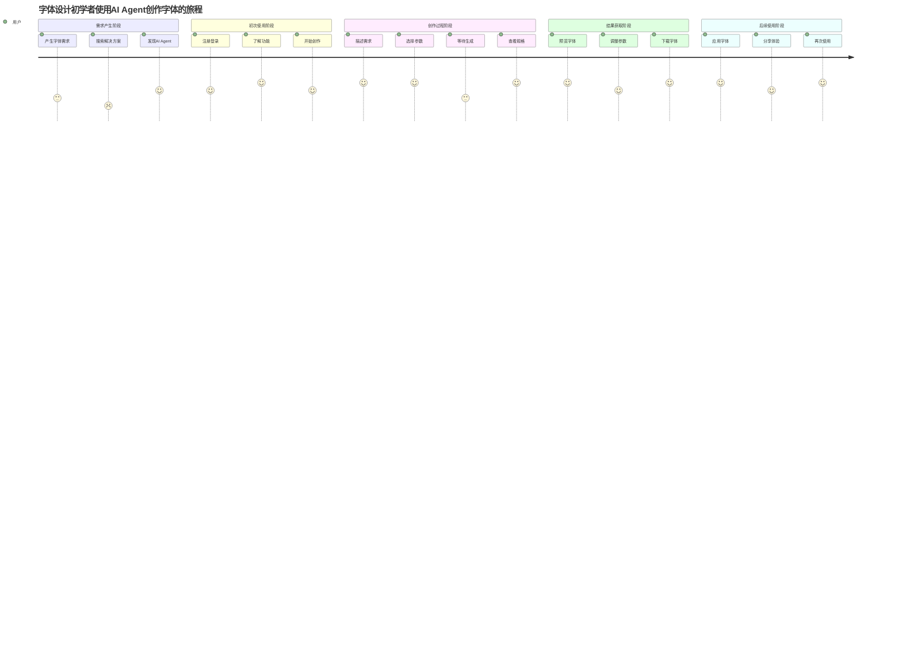
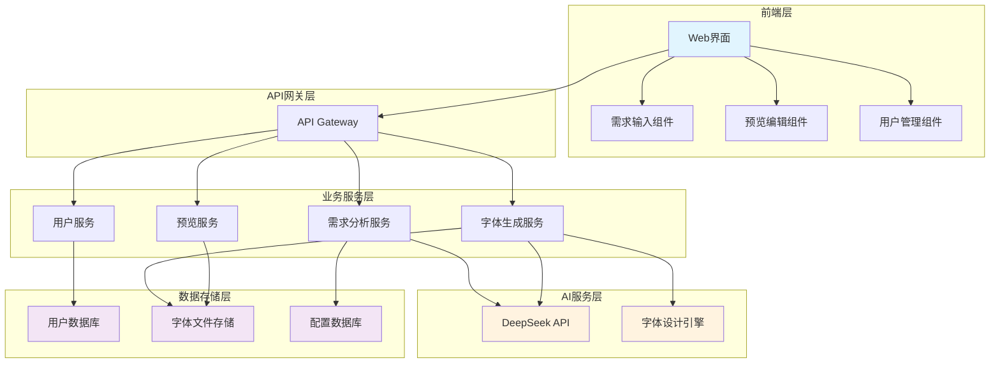
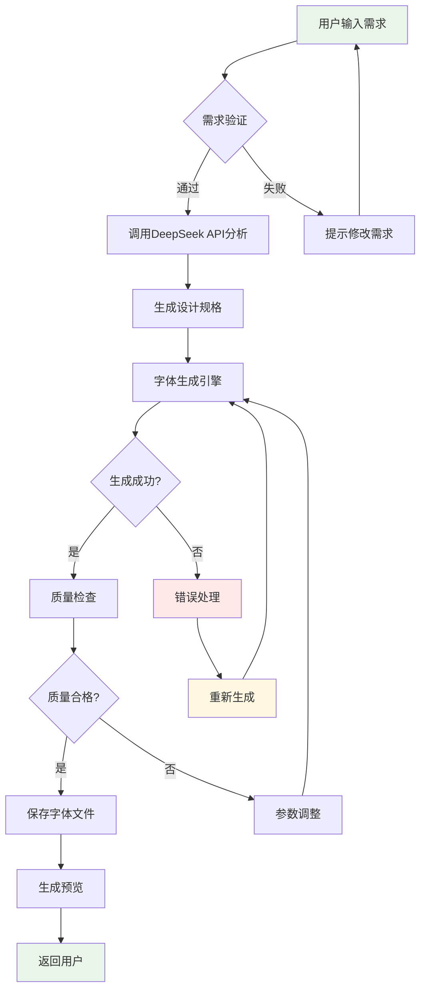
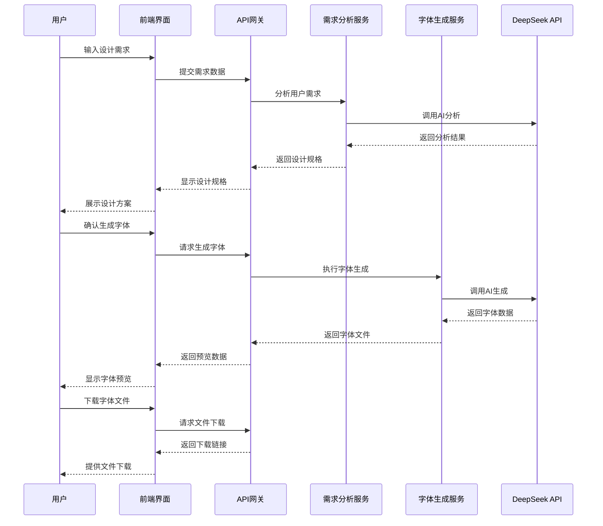

# 英文字体创作AI Agent - 产品需求文档 (PRD)

## 文档信息

| 项目 | 内容 |
|------|------|
| 文档版本 | V1.0 |
| 创建日期 | 2024年12月 |
| 编写人员 | PRD大师智能体 |
| 文档状态 | 初稿 |
| 更新记录 | 初始版本创建 |

---

## 1. 产品概述

### 1.1 产品背景

字体设计是一个专业性极强的领域，传统的字体创作流程复杂、技术门槛高，对于初学者来说存在以下主要痛点：

- **技术门槛高**：需要掌握专业的字体设计软件和技术知识
- **设计过程复杂**：从概念到成品需要经历多个复杂的设计阶段
- **缺乏专业指导**：初学者难以获得系统性的设计指导和反馈
- **时间成本高**：完成一套完整字体需要大量时间投入
- **版权风险**：容易无意中侵犯现有字体的版权

### 1.2 产品目标

**主要目标**：为字体设计初学者提供一个智能化的字体创作助手，通过AI技术大幅降低字体设计门槛，加速字体创作效率。

**具体目标**：
- 将字体创作时间从数周缩短到几分钟
- 为用户生成完整的字体设计规格文档
- 输出可用的字体原型文件，支持后续优化
- 确保生成的字体完全原创，无版权争议
- 提供简单易用的交互界面，适合初学者使用

### 1.3 核心价值主张

**"让每个人都能在几分钟内创作出专业级的原创英文字体"**

- **快速生成**：通过AI理解用户需求，快速生成字体设计规格和原型
- **零门槛使用**：无需专业知识，通过简单的选项和描述即可开始创作
- **完全原创**：确保生成的字体100%原创，无版权风险
- **持续优化**：提供可编辑的字体文件，支持用户后续调整和完善
- **免费使用**：降低使用成本，让更多人能够接触字体设计

### 1.4 成功指标定义


**产品指标**：
- 字体生成成功率 > 95%
- 平均生成时间 < 5分钟
- 用户完成率 > 80%（从开始到获得字体文件）

---

## 2. 目标用户画像

### 2.1 主要用户角色（Primary Persona）

**角色名称**：字体设计初学者 - "小白创作者"

**基本特征**：
- 年龄：20-35岁
- 职业：学生、设计师、开发者、创意工作者
- 技术水平：对字体设计完全陌生或略有了解
- 设计经验：可能有一定的平面设计基础，但缺乏字体设计经验

**需求特点**：
- 希望快速上手字体设计
- 需要简单易懂的操作流程
- 对字体质量有一定要求，但不追求极致专业
- 重视原创性和版权安全
- 预算有限，倾向于免费或低成本解决方案

**使用场景**：
- 个人项目需要独特字体
- 学习和练习字体设计
- 为小型创意项目制作字体
- 探索字体设计的可能性

**痛点**：
- 不知道从何开始学习字体设计
- 专业软件太复杂，学习成本高
- 缺乏设计灵感和指导
- 担心版权问题
- 时间有限，希望快速看到结果

**期望**：
- 简单直观的操作界面
- 快速生成可用的字体
- 获得专业的设计建议
- 学习字体设计知识
- 获得完全原创的字体文件

---

## 3. 用户故事

### 3.1 用户角色定义

**主要用户角色**：字体设计初学者
- 特征：对字体设计感兴趣但缺乏专业知识
- 需求：快速创作原创字体用于个人项目
- 目标：在短时间内获得满意的字体设计成果

### 3.2 核心用户故事

#### 故事1：快速字体创作
**标准格式**：作为字体设计初学者，我希望能够通过简单的描述和选择快速生成一套完整的英文字体，以便用于我的个人项目。

**详细格式**：在需要为个人博客设计独特字体的场景下，作为字体设计初学者，我希望能够通过文字描述我的设计需求并选择字体类型和风格，以便在几分钟内获得一套可用的原创字体文件，从而避免版权风险并提升项目的独特性。

**验收标准**：
- 功能性验收标准：
  - 用户可以通过文字描述设计需求
  - 系统提供字体类型选择（衬线体、无衬线体、等宽字体）
  - 系统提供字重选择（粗体、正常、细体、超细体）
  - 生成完整的字符集（26个大小写字母、0-9数字、常见标点符号）
- 性能验收标准：
  - 字体生成时间不超过5分钟
  - 生成的字体文件格式正确且可用
- 用户体验验收标准：
  - 操作流程简单直观，不超过5个步骤
  - 提供实时预览功能

#### 故事2：设计规格生成
**标准格式**：作为字体设计初学者，我希望AI能够根据我的需求生成详细的字体设计规格文档，以便我了解字体的设计原理和参数。

**详细格式**：在学习字体设计过程中，作为字体设计初学者，我希望AI能够分析我的设计需求并生成包含字体风格、比例、间距等详细参数的设计规格文档，以便我学习专业的字体设计知识并为后续优化提供指导。

**验收标准**：
- 功能性验收标准：
  - 生成包含字体基本信息的规格文档
  - 包含字体设计的关键参数（字高、字宽、间距等）
  - 提供设计理念和风格说明
- 性能验收标准：
  - 规格文档生成时间不超过2分钟
- 用户体验验收标准：
  - 文档内容通俗易懂，适合初学者理解
  - 提供可视化的参数说明

#### 故事3：字体预览和调整
**标准格式**：作为字体设计初学者，我希望能够预览生成的字体效果并进行简单调整，以便获得更满意的设计结果。

**详细格式**：在获得初始字体设计后，作为字体设计初学者，我希望能够在不同文本内容和尺寸下预览字体效果，并能够调整基本参数如字重、间距等，以便优化字体的视觉效果和实用性。

**验收标准**：
- 功能性验收标准：
  - 提供多种预览文本选项
  - 支持不同字号的预览
  - 允许调整字重、字间距等基本参数
- 性能验收标准：
  - 预览更新响应时间不超过2秒
- 用户体验验收标准：
  - 预览界面清晰直观
  - 调整操作简单易懂

### 3.3 用户旅程地图



---

## 4. 功能需求

### 4.1 功能模块划分

#### 4.1.1 核心功能模块

**1. 需求收集模块**
- 文字描述输入
- 参考图片上传
- 预设选项选择
- 使用场景描述

**2. 设计规格生成模块**
- AI需求分析
- 设计参数计算
- 规格文档生成
- 设计建议提供

**3. 字体生成模块**
- 字符设计生成
- 字体文件构建
- 格式转换输出
- 质量检查验证

**4. 预览编辑模块**
- 实时字体预览
- 参数调整界面
- 对比显示功能
- 导出预览图

#### 4.1.2 支撑功能模块

**5. 用户管理模块**
- 用户注册登录
- 个人信息管理
- 创作历史记录
- 偏好设置保存

**6. 配置管理模块**
- DeepSeek API配置
- 系统参数设置
- 模板管理
- 缓存管理

### 4.2 功能详细描述

#### 4.2.1 需求收集模块

**功能输入**：
- 用户文字描述（设计需求、使用场景、风格偏好）
- 参考图片文件（可选）
- 预设选项选择（字体类型、字重、字符集）

**处理逻辑**：
1. 接收用户输入的多种形式需求信息
2. 对文字描述进行自然语言处理和关键词提取
3. 分析参考图片的视觉特征（如有）
4. 结合预设选项形成结构化需求数据
5. 验证需求完整性和合理性

**功能输出**：
- 结构化的设计需求数据
- 需求完整性检查报告
- 设计方向建议

**标准JSON需求格式**：
```json
{
  "requestInfo": {
    "requestId": "req_12345",
    "timestamp": "2024-01-15T10:30:00Z",
    "userId": "user_001"
  },
  "userInput": {
    "textDescription": "现代简洁的无衬线字体，适用于科技产品",
    "referenceImages": [
      {
        "imageId": "img_001",
        "imageData": "base64_encoded_image_data",
        "description": "参考字体样式"
      }
    ],
    "useCase": "个人博客标题",
    "targetAudience": "科技产品用户",
    "designGoals": ["现代感", "可读性", "专业性"]
  },
  "presetSelections": {
    "fontType": "sans-serif",
    "fontWeight": "normal",
    "characterSet": {
      "uppercase": true,
      "lowercase": true,
      "numbers": true,
      "punctuation": true,
      "specialChars": false
    },
    "stylePreferences": {
      "contrast": "medium",
      "spacing": "normal",
      "personality": "modern"
    }
  },
  "extractedKeywords": {
    "styleKeywords": ["现代", "简洁", "科技感"],
    "functionalKeywords": ["可读性", "专业", "清晰"],
    "emotionalKeywords": ["信任", "创新", "效率"]
  },
  "validationStatus": {
    "isComplete": true,
    "missingFields": [],
    "suggestions": ["考虑添加品牌色彩偏好", "明确使用尺寸范围"]
  }
}
```

#### 4.2.2 设计规格生成模块

**功能输入**：
- 结构化需求数据
- 字体设计知识库
- 设计规则模板

**处理逻辑**：
1. 调用DeepSeek API分析设计需求
2. 基于字体设计原理生成设计参数
3. 计算字体的基本比例和间距
4. 生成详细的设计规格文档
5. 提供设计理念和风格说明

**功能输出**：
- 标准JSON格式的字体设计规格文档
- 完整的设计参数配置
- 结构化的视觉风格指导

**标准JSON规格格式**：
```json
{
  "metadata": {
    "specVersion": "1.0",
    "generatedAt": "2024-01-15T10:30:00Z",
    "requestId": "req_12345",
    "fontId": "font_custom_001"
  },
  "basicInfo": {
    "fontFamily": "CustomFont",
    "fontName": "Custom Sans Regular",
    "style": "sans-serif",
    "weight": "normal",
    "category": "display",
    "language": "latin",
    "version": "1.0.0"
  },
  "designParameters": {
    "metrics": {
      "unitsPerEm": 1000,
      "xHeight": 500,
      "capHeight": 700,
      "ascender": 800,
      "descender": -200,
      "lineHeight": 1200,
      "baseline": 0
    },
    "spacing": {
      "letterSpacing": 0,
      "wordSpacing": 250,
      "tracking": 0,
      "kerning": true
    },
    "proportions": {
      "contrast": "low",
      "strokeWidth": 80,
      "xHeightRatio": 0.5,
      "capHeightRatio": 0.7,
      "aspectRatio": "normal"
    }
  },
  "styleDefinition": {
    "concept": "现代简洁的无衬线字体设计，强调可读性和科技感",
    "characteristics": [
      "几何形状",
      "统一笔画粗细", 
      "开放字符间距",
      "现代感",
      "高可读性"
    ],
    "visualStyle": {
      "terminals": "straight",
      "corners": "rounded",
      "aperture": "open",
      "axis": "vertical",
      "stress": "none"
    }
  },
  "characterSet": {
    "uppercase": ["A", "B", "C", "D", "E", "F", "G", "H", "I", "J", "K", "L", "M", "N", "O", "P", "Q", "R", "S", "T", "U", "V", "W", "X", "Y", "Z"],
    "lowercase": ["a", "b", "c", "d", "e", "f", "g", "h", "i", "j", "k", "l", "m", "n", "o", "p", "q", "r", "s", "t", "u", "v", "w", "x", "y", "z"],
    "numbers": ["0", "1", "2", "3", "4", "5", "6", "7", "8", "9"],
    "punctuation": [".", ",", "!", "?", ";", ":", "'", "\"", "-", "(", ")", "[", "]", "{", "}", "/", "\\", "@", "#", "$", "%", "&", "*", "+", "="]
  },
  "designRules": {
    "consistency": {
      "strokeWeight": "uniform",
      "characterWidth": "proportional",
      "baseline": "aligned",
      "opticalCorrection": true
    },
    "legibility": {
      "minSize": 8,
      "maxSize": 144,
      "screenOptimized": true,
      "printOptimized": true
    }
  },
  "technicalSpecs": {
    "format": ["TTF", "OTF"],
    "encoding": "Unicode",
    "hinting": "TrueType",
    "compression": "standard",
    "features": {
      "kerning": true,
      "ligatures": false,
      "alternates": false,
      "numerals": "lining"
    }
  },
  "qualityMetrics": {
    "readabilityScore": 85,
    "aestheticScore": 90,
    "technicalScore": 88,
    "overallScore": 87.7
  }
}
```

#### 4.2.3 字体生成模块

**功能输入**：
- 字体设计规格
- 字符集定义
- 生成参数配置

**处理逻辑**：
1. 基于设计规格生成每个字符的矢量路径
2. 应用统一的设计风格和比例
3. 生成完整的字符集（A-Z, a-z, 0-9, 标点符号）
4. 构建字体文件结构
5. 进行质量检查和优化

**功能输出**：
- TTF/OTF格式字体文件
- 字体预览图
- 字符映射表

#### 4.2.4 预览编辑模块

**功能输入**：
- 生成的字体文件
- 预览文本内容
- 显示参数设置

**处理逻辑**：
1. 加载字体文件到预览引擎
2. 渲染不同尺寸和样式的文本
3. 提供参数调整界面
4. 实时更新预览效果
5. 生成对比显示

**功能输出**：
- 实时字体预览
- 参数调整界面
- 预览图导出

### 4.3 业务规则

#### 4.3.1 数据验证规则
- 文字描述长度：10-500字符
- 参考图片大小：最大5MB，支持JPG/PNG格式
- 字符集必须包含基本英文字母
- 字体名称不能与现有字体重复

#### 4.3.2 权限控制规则
- 所有用户均可免费使用基本功能
- 单个用户每日生成字体数量限制：10套
- 生成的字体文件保留期：30天
- 用户对自己生成的字体拥有完全使用权

#### 4.3.3 业务流程规则
- 需求收集 → 规格生成 → 字体生成 → 预览编辑 → 文件下载
- 每个步骤必须成功完成才能进入下一步
- 用户可以在预览阶段返回修改需求
- 系统自动保存用户的创作历史

### 4.4 异常处理

#### 4.4.1 系统异常处理
- **API调用失败**：提供重试机制，最多重试3次
- **字体生成失败**：回滚到上一步，提示用户调整参数
- **文件损坏**：自动重新生成，确保文件完整性

#### 4.4.2 用户操作异常
- **输入内容不合规**：实时验证并提示修改建议
- **网络中断**：本地缓存用户输入，支持断点续传
- **浏览器兼容性**：提供降级方案，确保基本功能可用

#### 4.4.3 数据异常处理
- **字符集不完整**：自动补全缺失字符
- **设计参数冲突**：智能调整参数，确保字体可用性
- **文件格式错误**：自动转换为标准格式

### 4.5 JSON规格标准

#### 4.5.1 规格标准概述

本系统采用标准化的JSON格式来定义和传输字体设计规格，确保数据的一致性、可读性和可扩展性。所有的设计规格（spec）都必须遵循以下JSON标准格式。

#### 4.5.2 JSON Schema定义

**核心原则**：
- 所有JSON对象必须包含版本信息和元数据
- 使用驼峰命名法（camelCase）
- 数值类型明确定义（整数/浮点数）
- 枚举值使用预定义常量
- 支持向后兼容的扩展机制

#### 4.5.3 字体规格JSON标准结构

```json
{
  "$schema": "https://fontcreator.ai/schema/font-spec-v1.0.json",
  "metadata": {
    "specVersion": "string (required) - 规格版本号",
    "generatedAt": "string (required) - ISO 8601时间戳",
    "requestId": "string (required) - 请求唯一标识",
    "fontId": "string (required) - 字体唯一标识",
    "generator": "string (optional) - 生成器信息"
  },
  "basicInfo": {
    "fontFamily": "string (required) - 字体族名称",
    "fontName": "string (required) - 完整字体名称",
    "style": "enum (required) - serif|sans-serif|monospace",
    "weight": "enum (required) - thin|light|normal|bold",
    "category": "enum (required) - display|text|decorative",
    "language": "string (required) - 语言代码，如latin",
    "version": "string (required) - 字体版本号"
  },
  "designParameters": {
    "metrics": {
      "unitsPerEm": "integer (required) - 字体单位，通常1000",
      "xHeight": "integer (required) - x字高",
      "capHeight": "integer (required) - 大写字母高度",
      "ascender": "integer (required) - 上升部高度",
      "descender": "integer (required) - 下降部高度（负值）",
      "lineHeight": "integer (required) - 行高",
      "baseline": "integer (required) - 基线位置，通常0"
    },
    "spacing": {
      "letterSpacing": "integer (required) - 字母间距",
      "wordSpacing": "integer (required) - 单词间距",
      "tracking": "integer (optional) - 字符跟踪",
      "kerning": "boolean (required) - 是否启用字距调整"
    },
    "proportions": {
      "contrast": "enum (required) - none|low|medium|high",
      "strokeWidth": "integer (required) - 笔画宽度",
      "xHeightRatio": "float (required) - x字高比例",
      "capHeightRatio": "float (required) - 大写字母高度比例",
      "aspectRatio": "enum (required) - condensed|normal|extended"
    }
  },
  "styleDefinition": {
    "concept": "string (required) - 设计理念描述",
    "characteristics": "array[string] (required) - 特征列表",
    "visualStyle": {
      "terminals": "enum (required) - straight|curved|angled",
      "corners": "enum (required) - sharp|rounded|soft",
      "aperture": "enum (required) - closed|open|semi-open",
      "axis": "enum (required) - vertical|angled|mixed",
      "stress": "enum (required) - none|vertical|angled|reverse"
    }
  },
  "characterSet": {
    "uppercase": "array[string] (required) - 大写字母列表",
    "lowercase": "array[string] (required) - 小写字母列表", 
    "numbers": "array[string] (required) - 数字列表",
    "punctuation": "array[string] (required) - 标点符号列表",
    "specialChars": "array[string] (optional) - 特殊字符列表"
  },
  "designRules": {
    "consistency": {
      "strokeWeight": "enum (required) - uniform|varied|modulated",
      "characterWidth": "enum (required) - monospace|proportional",
      "baseline": "enum (required) - aligned|varied",
      "opticalCorrection": "boolean (required) - 光学校正"
    },
    "legibility": {
      "minSize": "integer (required) - 最小可读尺寸（pt）",
      "maxSize": "integer (required) - 最大推荐尺寸（pt）",
      "screenOptimized": "boolean (required) - 屏幕优化",
      "printOptimized": "boolean (required) - 印刷优化"
    }
  },
  "technicalSpecs": {
    "format": "array[string] (required) - 支持格式 [TTF, OTF, WOFF]",
    "encoding": "string (required) - 编码格式，如Unicode",
    "hinting": "enum (required) - none|TrueType|PostScript",
    "compression": "enum (required) - none|standard|optimized",
    "features": {
      "kerning": "boolean (required) - 字距调整",
      "ligatures": "boolean (optional) - 连字",
      "alternates": "boolean (optional) - 替代字符",
      "numerals": "enum (required) - lining|oldstyle|tabular"
    }
  },
  "qualityMetrics": {
    "readabilityScore": "float (required) - 可读性评分 0-100",
    "aestheticScore": "float (required) - 美观度评分 0-100", 
    "technicalScore": "float (required) - 技术质量评分 0-100",
    "overallScore": "float (required) - 综合评分 0-100"
  }
}
```

#### 4.5.4 JSON验证规则

**必填字段验证**：
- 所有标记为required的字段必须存在且非空
- 枚举值必须在预定义范围内
- 数值类型必须符合范围限制

**数据类型验证**：
- string: 非空字符串，长度限制1-200字符
- integer: 整数，范围-10000到10000
- float: 浮点数，精度保留2位小数
- boolean: 布尔值true/false
- array: 数组，最大长度100个元素

**业务逻辑验证**：
- ascender > capHeight > xHeight > 0 > descender
- strokeWidth应与字重weight相匹配
- characterSet中的字符不能重复
- qualityMetrics中的评分必须在0-100范围内

#### 4.5.5 JSON扩展机制

**版本兼容性**：
- 新版本必须向后兼容旧版本
- 新增字段使用optional标记
- 废弃字段保留但标记为deprecated

**自定义扩展**：
- 支持在根级别添加"extensions"对象
- 扩展字段使用"x-"前缀命名
- 扩展内容不影响核心功能

```json
{
  "extensions": {
    "x-brandColors": ["#FF0000", "#00FF00"],
    "x-customMetrics": {
      "brandAlignment": 85,
      "emotionalImpact": 92
    }
  }
}
```

---

## 5. 优先级规划

### 5.1 优先级矩阵

基于业务价值和实现复杂度的四象限分析：

| 功能模块 | 业务价值 | 实现复杂度 | 优先级 | 版本规划 |
|----------|----------|------------|--------|----------|
| 需求收集模块 | 高 | 低 | P0 | MVP |
| 基础字体生成 | 高 | 中 | P0 | MVP |
| 简单预览功能 | 高 | 低 | P0 | MVP |
| 设计规格生成 | 高 | 中 | P1 | V1.0 |
| 参数调整功能 | 中 | 中 | P1 | V1.0 |
| 用户管理系统 | 中 | 低 | P1 | V1.0 |
| 高级预览功能 | 中 | 高 | P2 | V2.0 |
| 批量生成功能 | 低 | 高 | P3 | V2.0+ |

### 5.2 版本规划

#### 5.2.1 MVP版本（最小可行产品）
**目标**：验证核心价值假设，提供基本的字体生成功能

**核心功能**：
- 简单的需求输入界面
- 基础字体生成算法
- 基本预览和下载功能
- 支持3种字体类型（衬线体、无衬线体、等宽字体）
- 支持2种字重（正常、粗体）

**成功标准**：
- 用户能够成功生成可用的字体文件
- 字体生成成功率 > 80%
- 用户完成率 > 60%

#### 5.2.2 V1.0版本
**目标**：完善用户体验，增加专业功能

**新增功能**：
- 完整的设计规格生成
- 参数调整和优化功能
- 用户账户和历史记录
- 支持4种字重（超细体、细体、正常、粗体）
- 改进的预览界面

**成功标准**：
- 字体生成成功率 > 90%
- 用户完成率 > 75%
- 用户满意度 > 4.0分

#### 5.2.3 V2.0版本
**目标**：提升产品竞争力，增加高级功能

**新增功能**：
- 高级预览和对比功能
- 字体样式模板库
- 社区分享功能
- 批量字符生成
- 移动端适配

**成功标准**：
- 月活跃用户 > 500人
- 用户留存率 > 30%
- 用户满意度 > 4.5分

### 5.3 依赖分析

#### 5.3.1 技术依赖
- **DeepSeek API**：核心AI能力依赖，影响所有智能功能
- **字体渲染引擎**：影响预览和生成质量
- **前端框架**：影响用户界面和交互体验
- **后端服务**：影响系统稳定性和性能

#### 5.3.2 功能依赖
- 设计规格生成 ← 需求收集
- 字体生成 ← 设计规格生成
- 预览编辑 ← 字体生成
- 参数调整 ← 预览编辑

#### 5.3.3 资源依赖
- AI模型训练数据
- 字体设计专业知识
- 服务器计算资源
- 前端开发资源

### 5.4 风险评估

#### 5.4.1 技术风险
- **高风险**：AI生成质量不稳定
  - 应对策略：建立质量检查机制，提供人工审核
- **中风险**：API调用限制和成本
  - 应对策略：实施缓存策略，优化调用频率
- **低风险**：浏览器兼容性问题
  - 应对策略：采用成熟的前端框架，提供降级方案

#### 5.4.2 业务风险
- **高风险**：用户接受度不高
  - 应对策略：持续收集用户反馈，快速迭代优化
- **中风险**：竞争对手推出类似产品
  - 应对策略：建立技术壁垒，提升用户体验
- **低风险**：版权争议
  - 应对策略：确保生成算法的原创性，建立法律保护

---

## 6. 系统架构设计

### 6.1 系统整体架构图



### 6.2 数据流程图



### 6.3 用户交互流程图



### 6.4 接口设计规范

#### 6.4.1 RESTful API设计

**基础URL**：`https://api.fontcreator.ai/v1`

**通用响应格式**：
```json
{
  "code": 200,
  "message": "success",
  "data": {},
  "timestamp": "2024-12-01T10:00:00Z"
}
```

#### 6.4.2 核心接口定义

**1. 需求分析接口**
```
POST /analyze-requirements
Content-Type: application/json

Request Body:
{
  "textDescription": "string",
  "referenceImage": "string (base64)",
  "fontType": "serif|sans-serif|monospace",
  "fontWeight": "thin|light|normal|bold",
  "characterSet": ["A-Z", "a-z", "0-9", "punctuation"]
}

Response:
{
  "code": 200,
  "data": {
    "designSpec": {
      "fontFamily": "string",
      "style": "string",
      "parameters": {}
    },
    "recommendations": ["string"]
  }
}
```

**2. 字体生成接口**
```
POST /generate-font
Content-Type: application/json

Request Body:
{
  "designSpec": {},
  "options": {
    "format": "ttf|otf",
    "quality": "draft|standard|high"
  }
}

Response:
{
  "code": 200,
  "data": {
    "fontId": "string",
    "downloadUrl": "string",
    "previewUrl": "string",
    "metadata": {}
  }
}
```

**3. 预览接口**
```
GET /preview/{fontId}?text={text}&size={size}

Response:
{
  "code": 200,
  "data": {
    "previewImage": "string (base64)",
    "fontMetrics": {}
  }
}
```

---

## 7. 实施建议

### 7.1 开发建议

#### 7.1.1 技术栈推荐
- **前端**：React + TypeScript + Tailwind CSS
- **后端**：Node.js + Express + TypeScript
- **数据库**：PostgreSQL + Redis
- **文件存储**：AWS S3 或 阿里云OSS
- **AI服务**：DeepSeek API
- **部署**：Docker + Kubernetes

#### 7.1.2 开发流程
1. **MVP阶段**（4-6周）
   - 搭建基础架构
   - 实现核心功能
   - 集成DeepSeek API
   - 基础测试和部署

2. **V1.0阶段**（6-8周）
   - 完善用户体验
   - 增加高级功能
   - 性能优化
   - 全面测试

3. **V2.0阶段**（8-10周）
   - 新功能开发
   - 移动端适配
   - 社区功能
   - 运营支持

### 7.2 测试建议

#### 7.2.1 测试策略
- **单元测试**：覆盖率 > 80%
- **集成测试**：API接口测试
- **端到端测试**：用户流程测试
- **性能测试**：并发和响应时间测试
- **安全测试**：数据安全和API安全测试

#### 7.2.2 质量保证
- 建立自动化测试流水线
- 实施代码审查机制
- 定期进行安全扫描
- 用户体验测试

### 7.3 运营建议

#### 7.3.1 用户获取
- 内容营销：字体设计教程和案例
- 社交媒体推广
- 设计师社区合作
- SEO优化

#### 7.3.2 用户留存
- 新手引导优化
- 定期功能更新
- 用户反馈收集
- 社区建设

---

## 8. 附录

### 8.1 术语表

| 术语 | 定义 |
|------|------|
| 字体族 | 具有相同设计风格的字体集合 |
| 字重 | 字体笔画的粗细程度 |
| 字间距 | 字符之间的水平间距 |
| 行间距 | 文本行之间的垂直间距 |
| 基线 | 字符对齐的水平参考线 |
| x高度 | 小写字母x的高度 |
| 上升部 | 字符超出x高度的部分 |
| 下降部 | 字符低于基线的部分 |

### 8.2 参考资料

1. 《英文字体设计完整指南》- 项目内部文档
2. DeepSeek API 官方文档
3. 字体设计最佳实践指南
4. Web字体技术规范

### 8.3 更新记录

| 版本 | 日期 | 更新内容 | 更新人 |
|------|------|----------|--------|
| V1.0 | 2024-12-01 | 初始版本创建 | PRD大师智能体 |

---

**文档结束**

> 本PRD文档为英文字体创作AI Agent产品的完整需求规格说明，涵盖了产品概述、用户需求、功能规格、技术架构等各个方面。文档将作为产品开发、测试和运营的重要参考依据。